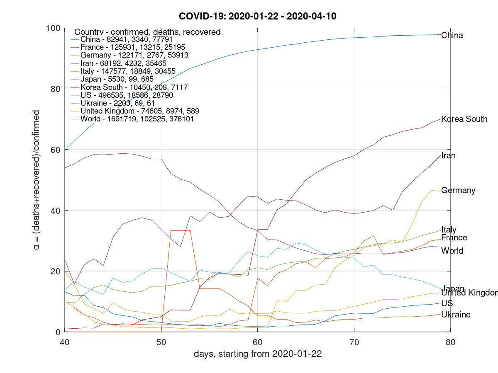
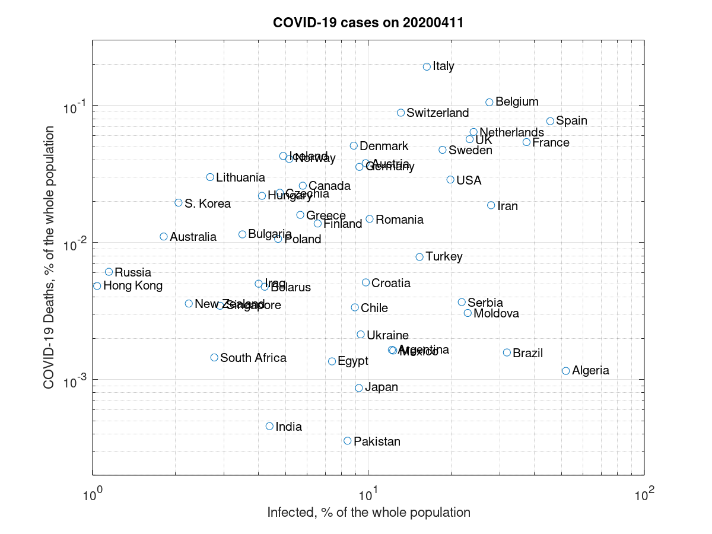

## COVID-19 data monitoring and analysis

Explanation and open source code can be found here:

* https://protw.github.io/covid/

### Assessment of the proximity to the pandenmic end

Based on the open data source, the parameter α is constructed, which characterizes the proximity of the country exit from the pandemic - the closer α to 100%, the closer a country has approached the exit of the pandemic:

### Realistic levels of infection and deaths

The emergence of data on tests carried out makes possible to estimate the total proportion of infected persons and the mortality (for COVID-19 reasons) relative to the population. These figures for some selected countries are shown in the graph below:

Stay tuned for our daily updates.